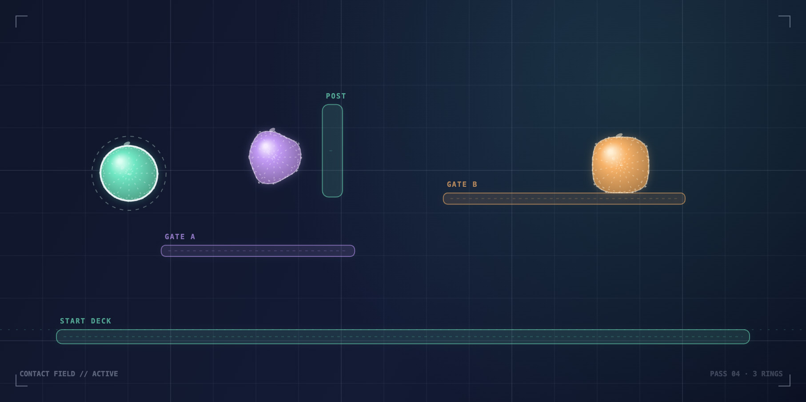

# Squish Circuit build log

These notes record the actual milestones behind the Stardance project. The attached image is an exported frame from the running playground, not a mockup.

## 01 — Choosing a direction

I compared five directions before implementation: SVG spring rings, a Canvas Verlet mesh, a WebGL metaball field, a constraint-library compound-body demo, and a hybrid playground. The hybrid Canvas 2D spring-ring approach won because it keeps the solver inspectable while still making room for a tactile interface and expressive materials. The decision record is in [`DECISIONS.md`](../DECISIONS.md).

## 02 — Making the bodies feel soft

The first useful physics pass used particle rings with Verlet integration. Structural edge springs hold the silhouette together, bend springs keep neighboring edges from folding too far, and cross-body links add a little more stability when objects touch. Area pressure compares the current polygon area with each body's rest area, so a body can compress and recover instead of behaving like a rigid box.

The arena then grew collision handling for bounds, static obstacle rectangles, friction, restitution, and pairwise body overlap. Pointer dragging became a throw interaction, which made it possible to test softness by hand rather than only watching an automatic animation.

## 03 — Turning the solver into a playground

The interface was built around the physics: material sliders expose softness, pressure, spring strength, and damping; world sliders expose gravity, friction, and restitution; and a live manifest plus selected-body inspector makes the simulated state legible. Seven presets cover jelly cubes, bouncing blobs, low and heavy gravity, an obstacle course, a squish test, and slow motion. Pause, reset, keyboard shortcuts, and spring guides make the playground practical to explore.

## 04 — Publishing and the final frame

The app was kept static: Vite builds the TypeScript and Canvas 2D client into `dist/`, with no backend or runtime service. The GitHub Pages workflow was enabled and the public demo was checked over HTTPS. The final obstacle-course state was exported with the app's **SAVE PNG** control and used as the project banner. The public links are kept in the project README.

## 05 — Small interaction polish

After the first live pass, I tightened two details that matter during repeated testing: slider tracks now show their actual normalized values instead of a fixed midpoint fill, and the spring-guide toggle can be driven with `G` in addition to the visible switch. The shortcut strip now exposes spawn and guide controls alongside pause, reset, and scene selection.

## 06 — Making feedback legible

The next polish pass made the scene and shape choices expose their selected state to assistive technology, added a small export-status readout for the **SAVE PNG** action, and kept the live slider track fill synchronized with each control. These changes preserve the compact visual system while making repeated exploration easier to understand.
